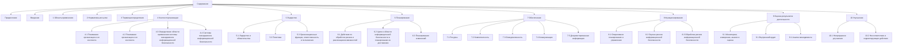

# Задание 2

```mermaid
graph TB;

A[Содержание]-->B[Предисловие];
A[Содержание]-->C[Введение];
A[Содержание]-->D[1 Областьприменения];
A[Содержание]-->E[2 Нормативныессылки];
A[Содержание]-->F[3 Терминыиопределения];
A[Содержание]-->G[4 Контексторганизации];
G[4 Контексторганизации]-->N[4.1 Понимание организации и ее контекста]
G[4 Контексторганизации]-->O[4.2 Понимание организации и ее контекста]
G[4 Контексторганизации]-->P[4.3 Определение области применения системы менеджмента информационной безопасности]
G[4 Контексторганизации]-->Q[4.4 Система менеджмента информационной безопасности]
A[Содержание]-->H[5 Лидерство];
H[5 Лидерство]-->R[5.1 Лидерство и обязательства]
H[5 Лидерство]-->S[5.2 Политика]
H[5 Лидерство]-->T[5.3 Организационные функции, ответственность и полномочия]
A[Содержание]-->I[6 Планирование];
I[6 Планирование]-->U[6.1 Действия по обработке рисков и реализации возможностей]
I[6 Планирование]-->V[6.2 Цели в области информационной безопасности и планирование их достижения]
I[6 Планирование]-->W[6.3 Планирование изменений] 
A[Содержание]-->J[7 Обеспечение];
J[7 Обеспечение]-->X[7.1 Ресурсы]
J[7 Обеспечение]-->Y[7.2 Компетентность]
J[7 Обеспечение]-->Z[7.3 Осведомленность]
J[7 Обеспечение]-->AA[7.4 Коммуникация]
J[7 Обеспечение]-->AB[7.5 Документированная информация]
A[Содержание]-->K[8 Функционирование];
K[8 Функционирование]-->AC[8.1 Оперативное планирование и управление]
K[8 Функционирование]-->AD[8.2 Оценка рисков информационной безопасности]
K[8 Функционирование]-->AE[8.3 Обработка рисков информационной безопасности]
A[Содержание]-->L[9 Оценка результатов деятельности];
L[9 Оценка результатов деятельности]-->AF[9.1 Мониторинг, измерение, анализ и оценка]
L[9 Оценка результатов деятельности]-->AG[9.1 Внутренний аудит]
L[9 Оценка результатов деятельности]-->AH[9.1 Анализ менеджмента]
A[Содержание]-->M[10 Улучшение];
M[10 Улучшение]-->AI[10.1 Непрерывное улучшение]
M[10 Улучшение]-->AJ[10.2 Несоответствия и корректирующие действия]

```