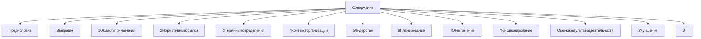

# Задание 2

```mermaid
graph TD;
    Содержание-->Предисловие;
    Содержание-->Введение;
    Содержание-->1Областьприменения;
    Содержание-->2Нормативныессылки;
    Содержание-->3Терминыиопределения;
    Содержание-->4Контексторганизации;
    Содержание-->5Лидерство;
    Содержание-->6Планирование;
    Содержание-->7Обеспечение;
    Содержание-->Функционирование;
    Содержание-->Оценкарезультатовдеятельности;
    Содержание-->Улучшение;
    Содержание-->D;
```